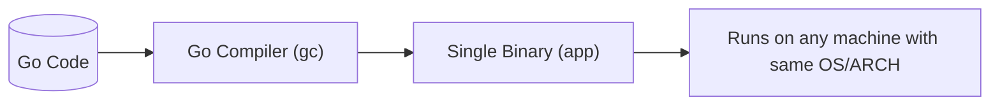

In Go, **"static linking"** means that **all dependencies** (including the Go runtime, 
standard library, and third-party packages) are **compiled directly into the final executable binary**.
This produces a single, self-contained file that can run on its own **without requiring external libraries** 
or a separate runtime environment.

---

### **Key Characteristics of Go's Static Linking**
| Feature | Explanation | Comparison to Others |
|---------|-------------|----------------------|
| **No External Dependencies** | The binary includes everything it needs to run. | Unlike Python/Node.js, which need interpreters. |
| **Single File Deployment** | Just copy the binary and run it. | No `.dll` (Windows) or `.so` (Linux) files needed. |
| **Cross-Platform Builds** | Use `GOOS` and `GOARCH` to compile for different systems. | Unlike .NET AOT, which requires per-platform builds. |
| **No Dynamic Linking** | All libraries are embedded in the binary. | Unlike C/C++, which often rely on shared libs (`libc.so`). |

---

### **How Static Linking Works in Go**
#### **1. Compilation Process**


#### **2. Example**
```go
// main.go
package main

import "fmt"

func main() {
    fmt.Println("Hello, static binary!")
}
```
Build it:
```bash
go build -o myapp  # Produces 'myapp' (statically linked)
```

#### **3. Verify Static Linking**
```bash
# On Linux/Mac:
file myapp          # Shows "statically linked"
ldd myapp           # Outputs "not a dynamic executable"

# On Windows:
dumpbin /dependents myapp.exe  # Shows no external DLLs
```

---

### **Comparison with Other Languages**
| Language | Linking Type | Deployment Complexity | Example |
|----------|-------------|-----------------------|---------|
| **Go** | Static (default) | Copy 1 file and run | `./myapp` |
| **C/C++** | Often dynamic | Need `libc.so`/`.dll` files | `./app` + `libstdc++.so.6` |
| **Python/Node.js** | Interpreted | Need interpreter (`python`, `node`) | `node app.js` |
| **.NET (JIT)** | Dynamic | Requires `.NET Runtime` | `dotnet app.dll` |
| **Rust** | Static (by default with `musl`) | Similar to Go | `./rust_app` |

---

### **Why Static Linking Matters**
1. **Simpler Deployment**  
   - No "dependency hell" (e.g., missing `.so` files or wrong versions).  
   - Works in **minimal containers** (e.g., `scratch` in Docker).  

2. **Better Portability**  
   - Run the same binary across machines (if OS/ARCH match).  

3. **Security**  
   - No runtime injection risks (e.g., hijacking `LD_PRELOAD` in Linux).  

4. **Performance**  
   - Faster startup (no dynamic linking overhead).  

---

### **When Go Uses Dynamic Linking**
Go **can** dynamically link in rare cases:
1. **Using `cgo`** (C interop): Depends on system libraries (e.g., `libc`).  
   ```bash
   CGO_ENABLED=1 go build  # May link dynamically to libc
   ```
2. **Plugins** (`.so` files): Rarely used.  

To **force static linking** even with `cgo`:
```bash
CGO_ENABLED=0 go build  # Pure static binary (no libc)
```

---

### **Static Linking vs. .NET AOT**
| Feature | Go (Static) | .NET AOT |
|---------|-------------|----------|
| **Default** | Yes | Opt-in (`-p:PublishAot`) |
| **Binary Size** | Small (~2MB for "Hello World") | Larger (~10MB, includes .NET runtime) |
| **Cross-Compile** | Easy (`GOOS=linux GOARCH=arm64`) | Requires per-platform builds (`-r linux-arm64`) |
| **Dynamic Features** | None (static by design) | Limited (e.g., no `Reflection.Emit`) |

---

### **Example: Minimal Dockerfile (Using Static Linking)**
```dockerfile
FROM scratch          # Empty base image
COPY myapp /myapp     # Add the binary
CMD ["/myapp"]        # Run it
```
The image will be **just a few MBs** (only the binary).

---

### **Key Takeaways**
1. Go binaries are **self-contained** by default.  
2. No need for interpreters or external libraries.  
3. Ideal for **cloud-native apps, CLI tools, and embedded systems**.  
4. Use `CGO_ENABLED=0` to **avoid `libc` dependencies** if needed.  

